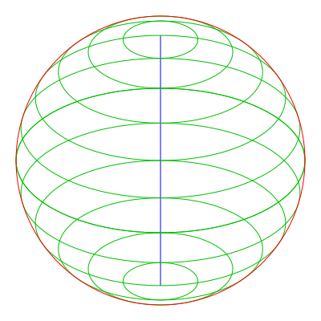
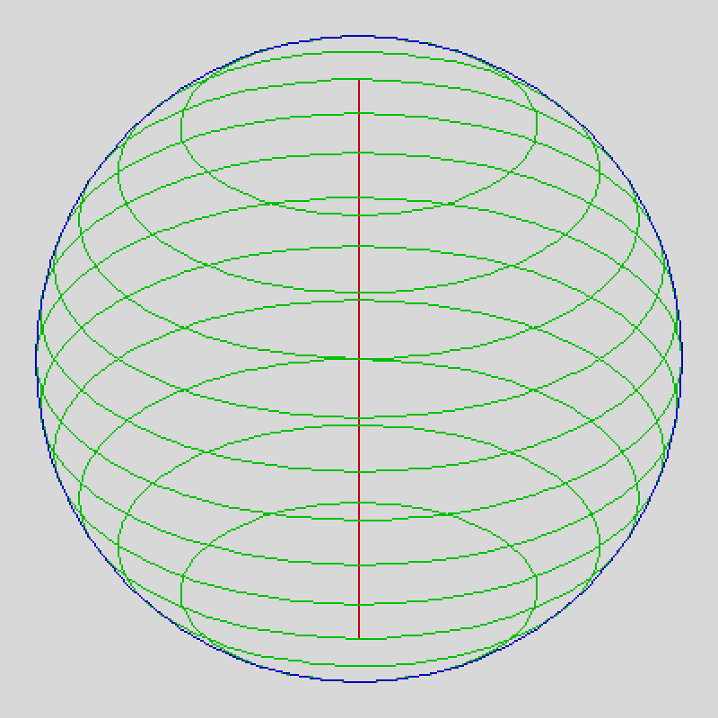
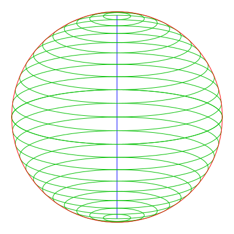
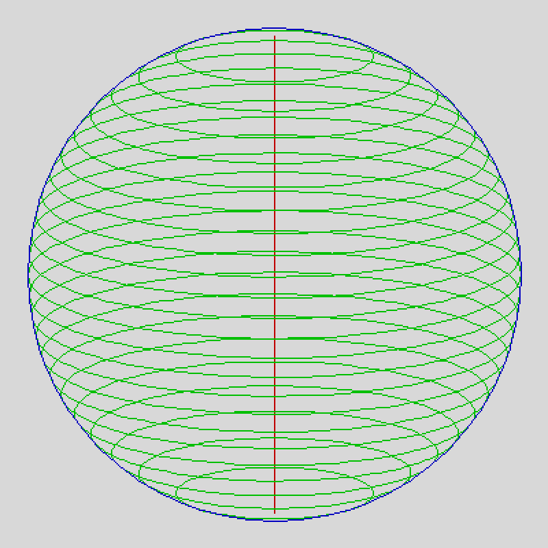
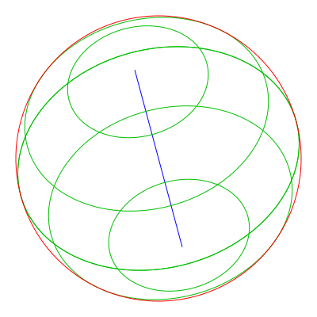
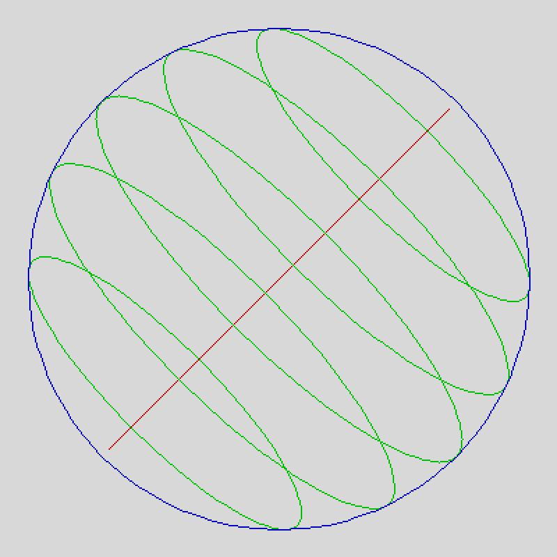
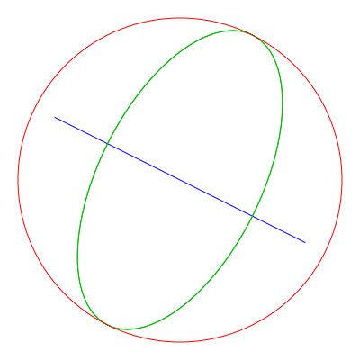
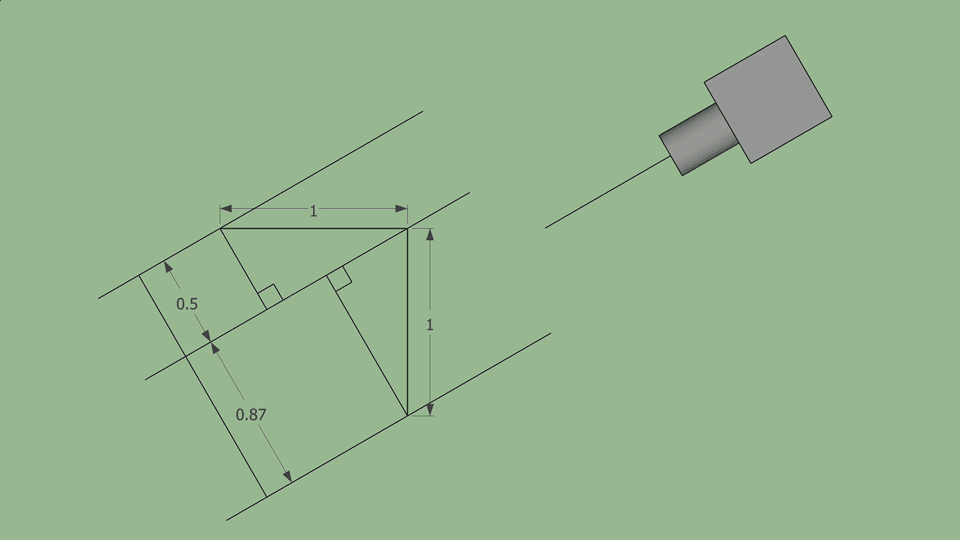

# Sphere Builder

Render an isometric sphere with slices. The slice count, camera pitch (also called 'tilt'), and camera roll, can all be set. Made with DrawBot/Python.

### Examples:

  
*12 slices, camera pitch 30°*
<!--   
*12 slices, camera pitch 30°* -->

  
*24 slices, camera pitch 15°*
<!--   
*24 slices, camera pitch 15°* -->

  
*6 slices, camera pitch 50°, camera roll 15°*
<!--   
*6 slices, camera pitch 15°, camera roll 45°* -->

  
*1 slice, camera pitch 30°, camera roll 63.435°*

### Math:

##### Calculate factors for Y and Z projection:

  
*Isometric projection geometry with a camera pitch of 30°. For projection, the y-axis is scaled by 0.87x and the z-axis by 0.5x.*

```processing
// Calculating the sides of a triangle
angleA = 90;
angleB = cameraPitch;
angleC = angleA - angleB;
sideA = 1; // normalized hypotenuse
sideB = sideA * sin(radians(angleC));
sideC = sideA * sin(radians(angleB));
```
