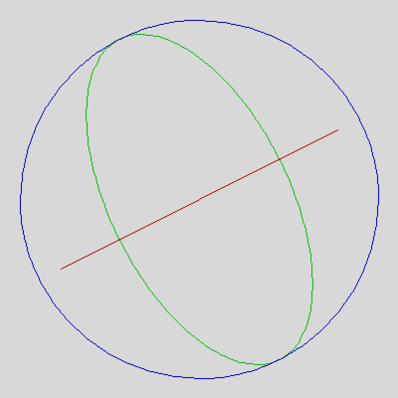

# eBoy Spherebuilder

Render an isometric sphere with slices. The camera's pitch (also called 'tilt'), and the roll can be set.

  
*12 slices, camera pitch 30°*

  
*24 slices, camera pitch 15°*

  
*6 slices, camera pitch 15°, camera roll 45°*

  
*1 slice, camera pitch 30°, camera roll 63.435°*

  
*Isometric projection geometry with a camera pitch of 30°*

```java
// Calculating the sides of a triangle
angleA = 90;
angleB = cameraPitch;
angleC = angleA - angleB;
sideA = 1; // normalized hypotenuse
sideB = sideA * sin(radians(angleC));
sideC = sideA * sin(radians(angleB));
```
