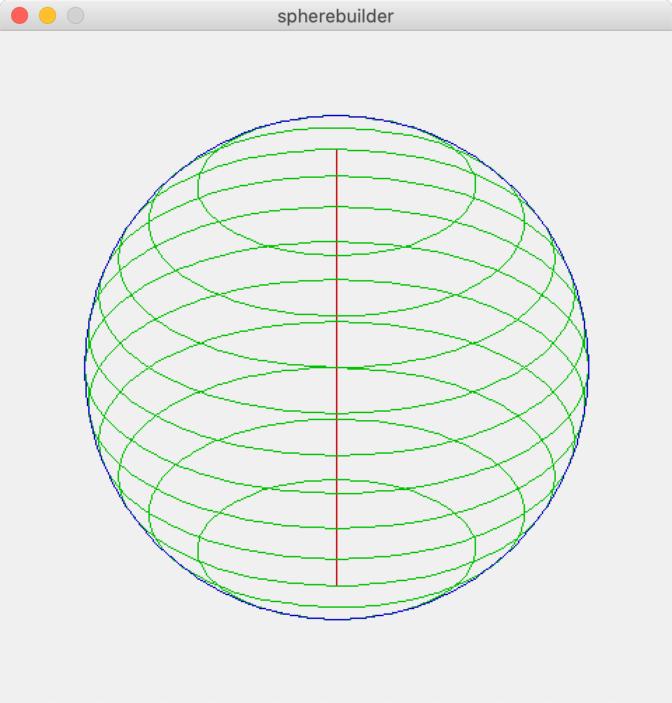
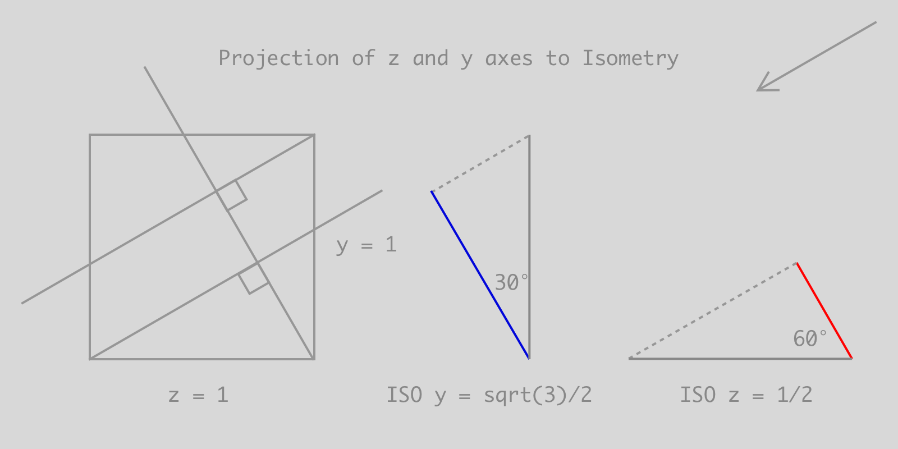

# eBoy Spherebuilder

Render an isometric sphere with slices. Camera angle and rotation can be set.


*Rendered sphere at 30 degrees*


*Projections of z and y axes to isometric camera view*

```java
// Calculating the sides of a triangle
angleA = 30; // any angle between 0 and 90
angleB = 90;
angleC = angleB - angleA;
aSide = cSide * sin(radians(angleC));
bSide = cSide * sin(radians(angleA));
cSide = 1; // hypotenuse is normalized

// the height y-compression is equal to the aSide
isoY = aSide;
// the depth z-compression is equal to the bSide
isoZ = bSide;

```
