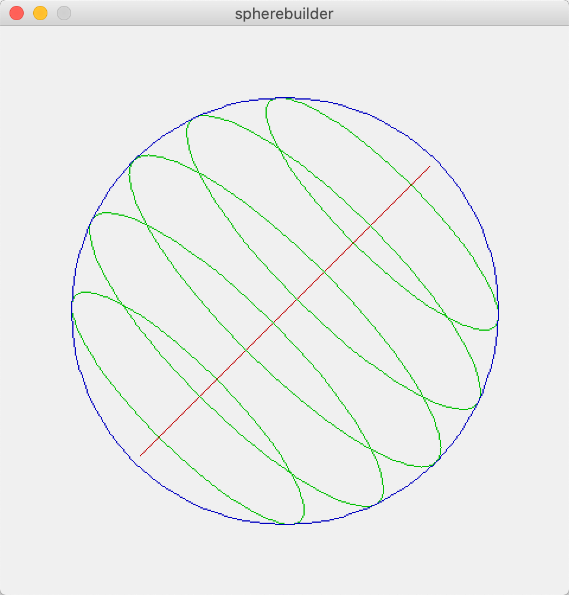

# eBoy Spherebuilder

Render an isometric sphere with slices. Camera angle and rotation can be set.


*The default eCity view: 12 slices, camera at 30°, no camera axis rotation*


*6 slices, camera at 15°, 45° camera axis rotation*


*24 slices, camera at 30 degrees, no camera axis rotation*


*Projections of z and y axes to isometric camera view*

```java
// Calculating the sides of a triangle
angleA = 90;
angleB = cameraAngle; // any angle between 0 and 90
angleC = angleA - angleB;
sideA = 1; // hypotenuse is normalized
sideB = sideA * sin(radians(angleC));
sideC = sideA * sin(radians(angleB));
```
